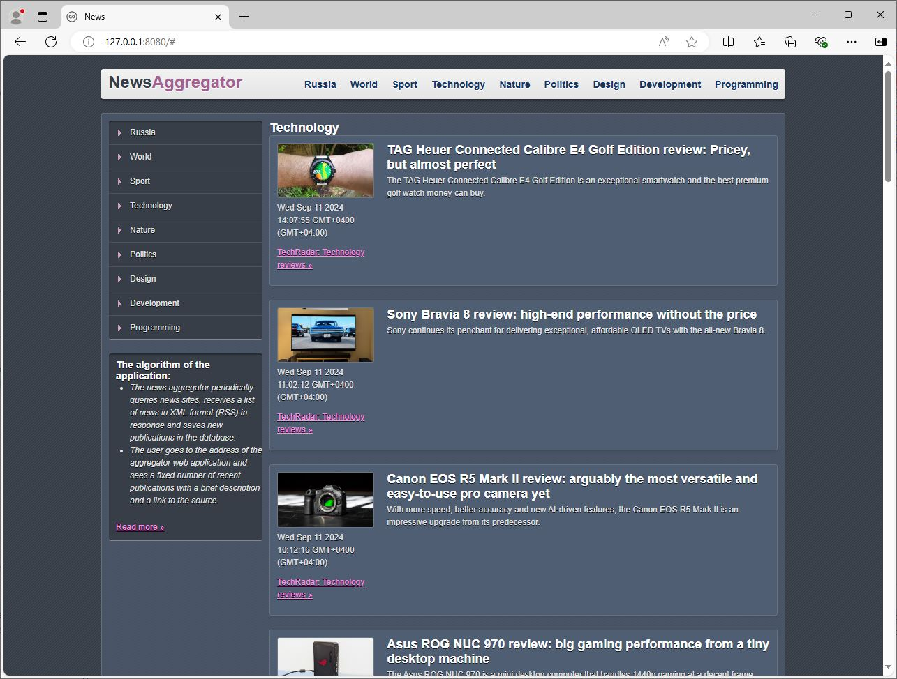

# NewsAggregator + Go

<div align="center">
	
</div>


## Структура программы:

Приложение состоит из сервера приложений, базы данных и веб-интерфейса пользователя.

**1) Сервер приложений:**<br>
- Сервер принимает на вход конфигурационный файл в формате JSON с массивом ссылок на RSS-ленты информационных сайтов и периодом опроса в минутах. Все ссылки на RSS-ленты информационных сайтов поделены на рубрики для удобства просмотра новостей.<br>
***taskNews\cmd\server\server.go***<br>
***taskNews\cmd\server\config.json*** - конфигурационный файл<br>

- Сервер регулярно выполняет обход всех переданных в конфигурации RSS-лент.<br>
- **rss:** пакет "rss" предназначен для декодирования XML потока RSS<br>
***taskNews\pkg\rss\rss.go***<br>
***taskNews\pkg\rss\rss_test.go***<br>

- Сервер предоставляет API, посредством которого осуществляется взаимодействие сервера и веб-интерфейса.
- API предоставляет метод для получения заданного количества новостей определенной рубрики. Требуемое количество публикаций и рубрика указываются в пути запроса метода API.
- **api:** пакет "api" реализует характерную для REST API схему запросов<br>
***taskNews\pkg\api\api.go***<br>
***taskNews\pkg\api\api_test.go***<br>
***/news/{rubric}/{countNews} - коллекции публикаций***<br>


**2) База данных:**<br>
Приложение позволяет использовать один из двух вариантов храниения публикаций(PostgreSQL, MongoDB). Тип используемой БД задается, как параметр при запуке приложения.

- **storage:** Interface задаёт контракт на работу с БД.<br>
***taskNews\pkg\storage\storage.go***<br>

- **postgres:** пакет "postgres" для поддержки базы данных под управлением СУБД PostgreSQL.<br>
!!! Для хранения соединения с БД используются переменные окружения:<br>
"NEWSDBPG" //используем реальную БД <br>
"NEWSDBPG_TEST" //используем тестовую БД<br>
***taskNews\pkg\storage\postgres\postgres.go***<br>
***taskNews\pkg\storage\postgres\postgres_test.go***<br>
***taskNews\cmd\server\ui\database\schema.sql*** - схема БД PostgreSQL в форме SQL-запроса<br>

- **mongo:** пакет "mongo" для поддержки базы данных под управлением MongoDB.<br>
!!! Для хранения соединения с БД используются переменные окружения:<br>
"NEWSDBMONGO" //используем реальную БД <br>
"NEWSDBMONGO_TEST" //используем тестовую БД<br>
***taskNews\pkg\storage\mongo\mongo.go***<br>
***taskNews\pkg\storage\mongo\mongo_test.go***<br>


Дополнительно для навигации по новостям введено поле "rubric", т.к. проект тестовый и рубрика выступает в качестве метки для удобной навигации, рубрика не выделена в отдельную таблицу, будет браться из конфига. Для этого поля в БД PostgreSQL создан index для ускорения поиска по БД(CREATE INDEX rubric_idx ON news (rubric))

Таким образом запись публикации в БД имеет следующие поля:
- id: уникальный id записи
- title: заголовок публикации
- content: краткое содержание публикации
- public_time: дата публикации
- image_link: ссылка на изображения
- rubric: рубрика
- link: ссылка на источник публикации
- link_title: наименование источник публикации 


**3) Веб-интерфейс пользователя:**<br>
***taskNews\cmd\server\ui\html\base.html***<br>
***taskNews\cmd\server\ui\html\routes.html***<br>
***taskNews\cmd\server\ui\html\style.css***<br>
***taskNews\cmd\server\ui\html\images***<br>

Веб-интерфейс получает от сервера приложений данные в формате JSON.
Запросы отправляются на URL, соответствующий коллекции ресурсов:
- коллекции публикаций "/news/{rubric}/{countNews}"


## Требования к системе:

Основные требования:
- проектирование модели данных,
- проектирование структуры пакетов приложения,
- проектирование логики сервера,
- реализация процесса взаимодействия с внешней системой,
- разработка модульных и интеграционных тестов.

Алгоритм работы приложения:
- Агрегатор новостей время от времени опрашивает новостные сайты, в ответ получает список новостей в формате XML (RSS) и сохраняет новые публикации в базу данных.
- Пользователь переходит по адресу веб-приложения агрегатора и видит фиксированное количество последних публикаций с кратким описанием и ссылкой на источник.

Требования:
- Приложение должно иметь веб-интерфейс с отображением десяти последних по времени публикаций.
- Приложение должно принимать на вход конфигурационный файл в формате JSON с массивом ссылок на RSS-ленты информационных сайтов и периодом опроса в минутах.
- Приложение должно регулярно выполнять обход всех переданных в конфигурации RSS-лент.
- Приложение должно выполнять чтение каждой RSS-ленты в отдельном потоке выполнения (горутине).
- Приложение должно сохранять публикации в БД.
- Приложение должно состоять из сервера приложений, базы данных и веб-интерфейса пользователя.
- Веб-интерфейс должен получать от сервера приложений данные в формате JSON.
- Сервер приложения должен предоставлять API, посредством которого осуществляется взаимодействие сервера и веб-интерфейса.
- API должен предоставлять метод для получения заданного количества новостей. Требуемое количество публикаций указывается в пути запроса метода API.
- Агрегатор должен хранить как минимум следующий набор данных для каждой публикации: (заголовок, описание, дата публикации, ссылка на источник).

Все выше перечисленные требования к системе учтены в проекте.

## Revision

- 1: add pkg (api, rss, postgres, mongo)


## Usage:

**1.Enter this command to start the program:**

**go run server.go -typebd pg**

1) typebd: This parameter is responsible for selecting the database.
- pg - PostgreSQL
- mongo - MongoDB

**go run server.go**

defualt value (-typebd pg)

**2.Open the web browser and go to:**

```sh

http://127.0.0.1:8080/ or  localhost:8080

```

## Authors:

@PolinaSvet

**!!! It is for test now !!!**